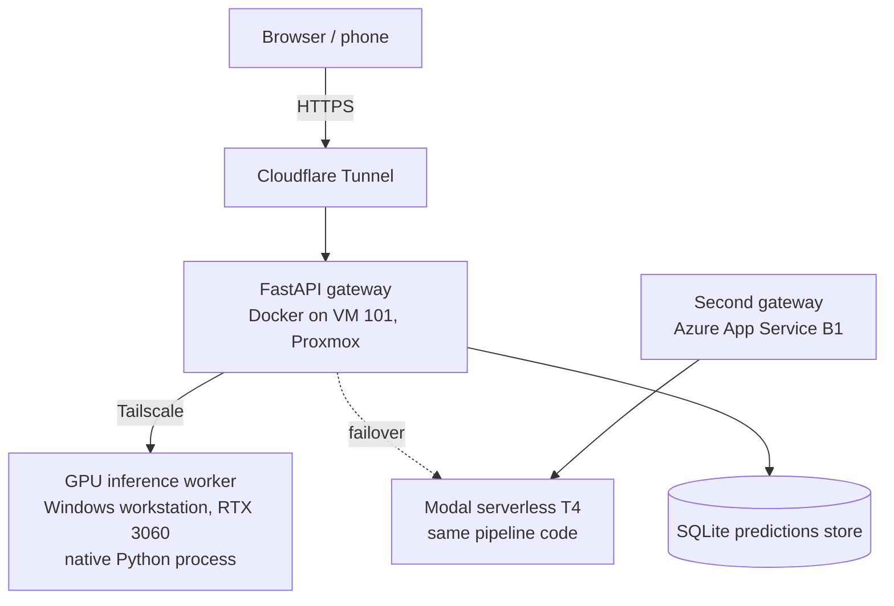

# PanelSafe: From a Panel Photo to an Electrical Audit

PanelSafe turns a photo of a residential electrical panel (*cuadro eléctrico*) into a structured
list of its protective devices, an REBT-based safety score, and a draft single-line diagram
(*esquema unifilar*) that a human reviews and corrects. It was built during the Ironhack Data
Science & ML bootcamp and has since been hardened into a small production service.

- **Live site:** [https://panelsafe.cv](https://panelsafe.cv) (analyzer, HITL workspace, unifilar tool; EN / ES / FR)
- **Azure gateway:** [https://app-panelsafe-mcneel.azurewebsites.net](https://app-panelsafe-mcneel.azurewebsites.net)
- **Knowledge base:** [`docs/okf/`](docs/okf/index.md), covering models, datasets, REBT rules and the evaluation methodology
- **Frozen v1.0 (data-analysis phase):** [release tag](https://github.com/cerrmcneel/breaker-detection-project/releases/tag/v1.0-data-analysis)

> PanelSafe produces *supporting documentation* and a consumer-facing indication. It does not
> issue a CIE / boletín eléctrico; in Spain only an *instalador autorizado* can.

---

## What it does

| Surface | What happens |
|---|---|
| **Consumer analyzer** (`/`, `/upload/`) | Photo → detected devices → REBT-based safety score and feedback. Refuses to invent a score when inference is unavailable. |
| **HITL workspace** (`analysis.html`, `/predict/`) | An electrician corrects boxes, classes and ratings on a pan/zoom canvas. Corrections are saved via `/active-learning/save` and linked to the original prediction. |
| **Unifilar generator** (`/unifilar/`) | A deterministic React/Vite app renders the corrected panel as an SVG single-line diagram (no LLM involved). |

Detected classes (`data.yaml`): `MCB` (PIA), `RCD` (diferencial), `RCD_SI` (superinmunizado),
`MAINBREAKER` (IGA), `OVERSURGE` (surge protection), `OTHER`.

---

## Architecture (as deployed, verified 2026-09-17)



- **Gateway** (`app/main.py`) runs no models. It validates uploads (decodes the image, enforces
  a streamed size limit), forwards to the GPU worker, fails over to Modal inside a shared time
  budget, grades the result, and records it.
- **GPU worker** (`src/model/inference_server.py`) is a plain `http.server` running
  `PanelSafePipeline`. It is started and auto-restarted by a Windows Scheduled Task
  (`scripts/start_inference.ps1`). `GET /` reports the served model's MD5, classes and git commit.
- **Failover:** Modal T4 (`deploy/modal_failover.py`). Measured 16.1 s cold, ~4 s warm.
- **Azure:** a second copy of the gateway on App Service with TLS; its primary inference target
  is the same Modal endpoint.
- **K3s history:** in May 2026 the worker ran as a K3s pod on the same GPU via WSL2
  (`yolo-inference-deployment.yaml`). It is **not** the current serving path.
- **Observability:** Prometheus and Grafana on a separate VM (separate `monitoring-stack` repo),
  scraping GPU, host and container metrics.

---

## The model, and honest numbers

**Production config** (`src/model/pipeline_config.json`): YOLO26-**Medium**, single-stage,
confidence 0.20, HMM corrector **off**.

Measured on **42 held-out real photos** (from ~121 real images in total). Every number traces
to [`docs/okf/methodology/ablation_study.md`](docs/okf/methodology/ablation_study.md).

| Model | Localization recall | Classification accuracy | Latency |
|---|---|---|---|
| Nano | 79.34% | 61.73% | 101.5 ms |
| **Medium (production)** | **84.18%** | 60.71% | 108.1 ms |
| Large | 82.65% | 62.76% | 120.6 ms |

- Medium was chosen for recall. A missed device is invisible to the human reviewer; a
  misclassified one can still be corrected.
- The synthetic-validation mAP50 of **0.974** is a *synthetic* number. It is kept only to
  illustrate the sim-to-real gap, not as real-world performance.
- **Cut on evidence:** the HMM sequence corrector (61.73% → 55.87%), a second-stage crop
  classifier, an augmentation change, SAHI slicing, and a "main breaker is leftmost" rule.
- **Evaluation bugs found and fixed:** a filename-allowlist bug had inflated the headline from
  a real **61.73%** to **81.08%**, and a `classes.txt` / `data.yaml` order mismatch had
  silently permuted every real label. See
  [`evaluation_rigor.md`](docs/okf/methodology/evaluation_rigor.md).

### Known limitations
- **The admin batch-upload UI is retired.** Its password prompt is still in the page but the
  endpoint it calls no longer exists. Bulk ingest is handled from the command line
  (`src/tools/sync_uploads.py`, `check_upload_batch.py`).
- **Breaker text (ratings like `C16`, the `SI` marker) is not read in production.** The OCR step
  in `pipeline.py` only runs when `use_hmm` is true, and HMM is disabled. The improved text
  cleaning (`_clean_ocr_text`, precision 69.1% → 94.4% on 1,060 real crops) is measured offline
  and tested, but does not reach production output until OCR is decoupled from the HMM flag.
- **Installation-era estimation** uses REBT composition rules. Its manufacturer-catalog branch
  needs OCR text, so it is currently inactive; its production-year table is also unverified.
- **Data is scarce.** Some classes (`RCD_SI`, `OVERSURGE`) have very few real examples.
  Automated retraining is deliberately deferred until every class has ≥100 real examples.

---

## Engineering

- **CI** (`.github/workflows/ci.yml`): `ruff` lint → `pytest` → Docker build.
- **Tests:** `python -m pytest src/tests/ -q` (203 passing on 2026-09-17).
- **API contracts:** Pydantic response models for `/predict/`, published in OpenAPI.
- **MLOps:** MLflow autologging (`src/model/train.py`); version registration and rollback
  (`src/tools/manage_model_version.py`).
- **Predictions store** (`src/storage/predictions_store.py`): SQLite. Raw model output is
  append-only, computed scores can be recomputed, and corrections link back via `tracking_id`.
- **De-duplication:** SHA-256 over *decoded pixels*, so a re-saved copy with different metadata
  is still recognised.
- **Two requirement sets:** `requirements.txt` is the lean gateway (Docker, Azure);
  `requirements-training.txt` adds torch, ultralytics, OCR and tests.
- **Synthetic data:** a REBT "grammar" panel generator with a compositor (`src/data_gen/`).

## Project structure

```plaintext
app/
  main.py                 FastAPI gateway: validation, failover, grading, storage
  frontend/               Analyzer, HITL workspace (analysis.html), blog (EN/ES/FR)
panel-safe-unifilar/      React/Vite single-line diagram generator (served at /unifilar)
src/
  model/                  pipeline, inference server, training, heuristics, OCR cleaning, era estimator
  data_gen/               synthetic panel grammar and compositor
  storage/                SQLite predictions/corrections store
  experiments/            A/B testing framework (work in progress)
  tools/                  evaluation, labeling, calibration, versioning, sync utilities
  tests/                  pytest suite
deploy/modal_failover.py  Modal serverless GPU deployment
scripts/                  inference-worker launchers (PowerShell / bash)
docs/okf/                 knowledge base
data.yaml                 class order (must match any external annotation tool)
docker-compose.yml        gateway + Cloudflare tunnel (VM 101)
```

## Running it

```bash
git clone https://github.com/cerrmcneel/breaker-detection-project.git
cd breaker-detection-project
pip install -r requirements-training.txt
```

Start the GPU worker, then the gateway:

```bash
INFERENCE_PORT=8088 ./scripts/start_inference.sh
```

```bash
INFERENCE_URL=http://localhost:8088/predict uvicorn app.main:app --port 8000
```

Model weights (`models/`) are not in the repository.

**Gateway environment variables:** `INFERENCE_URL`, `FAILOVER_URL` (empty means no failover),
`PRIMARY_ENGINE` / `FAILOVER_ENGINE` (optional labels), `INFERENCE_TIMEOUT`,
`FAILOVER_TIMEOUT`, `INFERENCE_BUDGET`, `UPLOAD_DIR`, `PREDICTIONS_DB_PATH`.
`docker-compose.yml` also needs `CLOUDFLARE_TUNNEL_TOKEN` in `.env`.

## About the developer

With a professional background as an **electrician** and **ESL teacher**, I am moving into
**data science and MLOps** to build tools for real problems in the electrical trade. This project
covers the whole path: data collection and labelling, model training and honest evaluation, and
serving it on real infrastructure.
