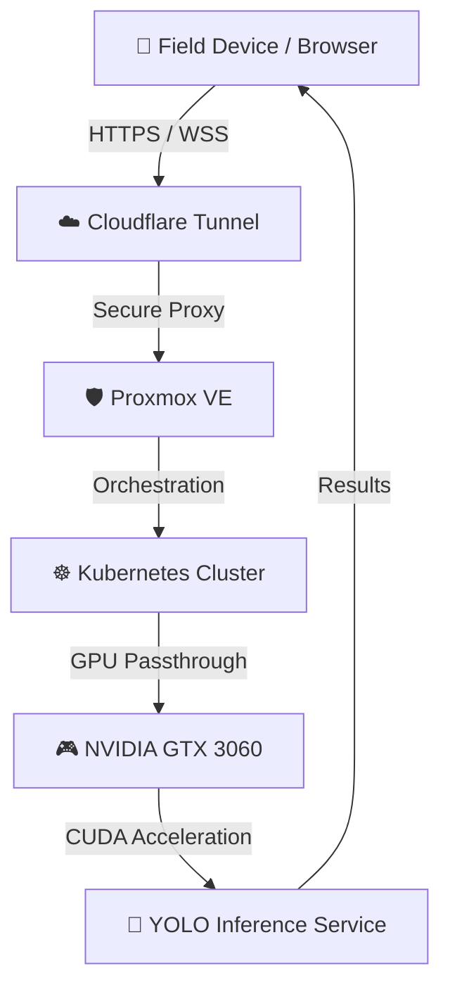

# PanelSafe: Electrical Breaker Detection Beta

PanelSafe is a computer vision data ingestion and analysis platform designed to automate the auditing of residential and industrial electrical panels. Developed during an intensive bootcamp, this project bridges the gap between traditional electrical expertise and modern AI-driven safety inspections.

## Project Evolution & Portfolio Milestones
This repository has evolved through distinct professional phases, reflecting my growth from Data Analysis to Machine Learning Engineering:

*   **[v1.0: Data Analysis Phase](https://github.com/cerrmcneel/breaker-detection-project/releases/tag/v1.0-data-analysis)**: Focus on EDA, data cleaning, and initial algorithmic logic. (Frozen for portfolio review).
*   **[Current: Machine Learning & Edge Phase]**: Implementation of YOLO26 for real-time breaker detection and synthetic dataset generation.

---

## Project Vision & Phase 3 Trajectory
PanelSafe is evolving from a standalone detection model into a two-tier Cloud/Edge platform:

1. **For Consumers (Safety Score):** A free tool that generates a safety score based on panel photos, putting users in contact with certified local electricians. This crowdsources real-world images to continuously improve the model.
2. **For Professionals (Human-in-the-Loop API):** An API that accelerates paperwork by automatically generating an *esquema unifilar* (single-line electrical diagram) using standard engineering symbols, with an electrician validating the AI's output.

### Technical Evolution (Constraints)
*   **Connectivity:** The initial "zero-connectivity basement" constraint has been officially dropped. To achieve maximum accuracy and support cloud-based OCR APIs (EasyOCR/PaddleOCR) for reading circuit diagrams, the system operates under a "Push Once Connected" asynchronous logic.
*   **Detection Strategy:** Shifting from pure YOLO visual detection to a **Two-Stage Architecture** combining YOLO Object Detection with a Python Spatial Heuristic Engine to contextualize breaker relationships (e.g., Mainbreaker isolation logic).

##  Features
- **Guided Viewfinder:** Real-time client-side analysis of image brightness, blurriness, and crop variance to guide users into taking the perfect dataset image.
- **Multi-Language Support:** Instant English/Spanish translation toggles for field workers across different regions.
- **Smart Deduplication:** Backend SHA-256 fingerprinting that silently ignores multiple uploads of the exact same image to save NAS storage.
- **Hidden Batch Upload:** Admin-only, password-protected batch upload utility to mass-ingest existing breaker datasets smoothly.
- **Live Progress Tracking:** Dynamic goal-oriented visual badges matching current database ingest sizes against target milestones in real time.

## 🏗️ Hybrid MLOps Infrastructure
PanelSafe leverages "Home-Lab Hybrid" architecture to provide high-performance AI inference without the cost of cloud GPUs.



### The Tech Stack
*   **AI/ML:** YOLO26-Nano for real-time object detection and classification.
*   **Inference Engine:** FastAPI-based inference server optimized for NVIDIA CUDA.
*   **Orchestration:** **Kubernetes (K3s/K8s)** managing container lifecycle and scaling.
*   **Hardware Acceleration:** **NVIDIA GTX 3060** utilizing PCIe passthrough via Proxmox.
*   **Networking:** **Cloudflare Tunnels** providing secure, end-to-end encrypted public access to the local cluster without exposing home router ports.
*   **Storage:** Distributed storage via **TrueNAS Core** (NFS/SMB) for massive image dataset persistence.


##  Project Structure
```plaintext
.
├── app/
│   ├── main.py            # FastAPI Logic, NAS Ingestion & Batch Deduplication
│   └── frontend/
│       ├── index.html     # SPA containing Guided Camera UI, i18n logic, and CSS styles
│       └── assets/        # Stored media (banners, etc.)
├── data/                  # Symlinked to TrueNAS Volume
│   ├── images/            # Raw .jpg/.png uploads
│   └── upload_log.json    # JSON Metadata (Timestamp, Country, SHA-256 Hash)
├── .env                   # Local secrets file for Admin passcodes
├── requirements.txt       # Python dependencies
├── Dockerfile             # Multi-stage Python build
└── docker-compose.yml     # App + Cloudflare Tunnel orchestration
```

## Deployment & Development
To replicate this environment:

**Clone and Configure:**
```bash
git clone https://github.com/cerrmcneel/breaker-detection-project.git
cd breaker-detection-project
```

**Set Environment Variables:**
1. Ensure your `TUNNEL_TOKEN` and `UPLOAD_DIR` are configured in the `docker-compose.yml`.
2. Create a `.env` file in the root directory to set your admin passcode for batch tools:
```env
ADMIN_PASSWORD=your_secure_password
```

**Launch Stack:**
```bash
docker-compose up -d --build
```

## 📈 Current Milestone: Production Ready (Phase 3)
We have successfully transitioned to the production inference phase. The system is now powered by a YOLO26-Nano model trained for 100 epochs, achieving a **0.974 mAP50**.

- **Live Portal:** [https://panelsafe.cv](https://panelsafe.cv)

## 👨‍💻 About the Developer
With a professional background as an **Electrician** and **ESL teacher**, I am transitioning into **Data Science** and **MLOps** to build tools that solve real-world problems in the electrical industry. This project demonstrates a full-stack engineering approach: from hardware-level GPU orchestration to high-level computer vision modeling.
