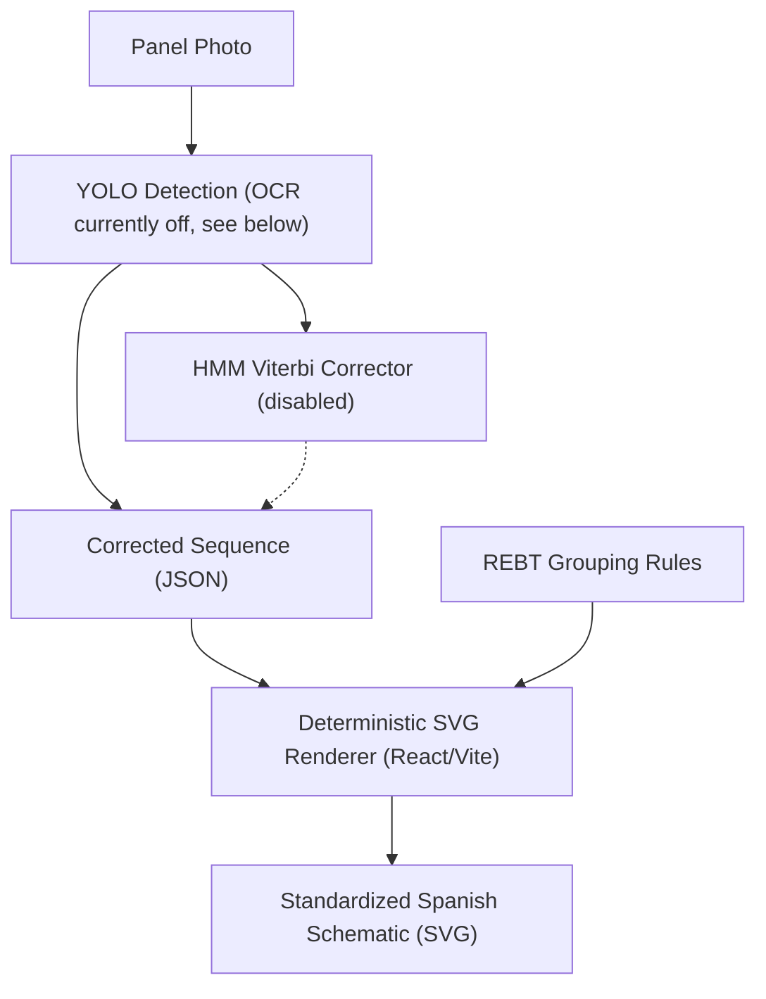

# Electrical Schematic Generator & Serving Infrastructure

The main value proposition of PanelSafe is helping electricians quickly produce *supporting*
documentation (single-line schematics, circuit schedules) from a single panel photo. It does
not produce the boletín / CIE itself, which in Spain only an *instalador autorizado* can issue.

> **Document scope:** This page describes the system **as currently built**. Components that are designed but not yet implemented are collected in the [Roadmap](#roadmap--not-yet-implemented) section at the end and must not be presented as live.

## Sequence-to-Schematic Pipeline

> **HMM correction is currently disabled** (`use_hmm: false`) — it measurably reduced
> classification accuracy on the full real val set. See [hmm_decoder](/models/hmm_decoder.md)
> for the ablation evidence and root-cause investigation. YOLO detections pass straight
> through to the corrected-sequence JSON.

## Current Implementation

### Gateway (`app/main.py`)
- A **FastAPI** application serves the consumer PWA (static frontend) and the compiled `panel-safe-unifilar` React app (mounted at `/unifilar`).
- It acts as a **lightweight router**: `/predict/` and `/upload/` forward the image to the GPU inference worker over the `INFERENCE_URL` endpoint (the `gpu-worker:8088` Tailscale alias). The gateway itself runs no models.
- If the primary fails, both endpoints fail over to `FAILOVER_URL` (the Modal T4 deployment in `deploy/modal_failover.py`) within a shared `INFERENCE_BUDGET`. If no failover is configured or both calls fail, `/predict/` returns 503, and `/upload/` keeps the photo but leaves out the score and feedback (`inference_ok: false`) rather than grading an empty result.
- `/upload/` additionally performs automated safety grading ([rebt_rules](/standards/rebt_rules.md)-based) and persists upload metadata to `upload_log.json`. Both endpoints record raw predictions in the SQLite store (`src/storage/predictions_store.py`).

### Inference Worker (`src/model/inference_server.py`)
- A standalone **Python `http.server` (`ThreadingHTTPServer`)** exposing `POST /predict` and an identity `GET /` (model MD5, classes, git commit). It is **not** FastAPI and currently has no rate-limiting or caching layer.
- It runs `PanelSafePipeline`: YOLO26 detection → optional crop classifier (`classifier_mode`, currently `single_stage`) → EasyOCR text reads → HMM Viterbi correction (`use_hmm`, currently **`false`** — see [hmm_decoder](/models/hmm_decoder.md) for why).
- **The OCR step is gated on `use_hmm`**, so with HMM off no text is read and every `ocr_text` is empty (verified against the live worker 2026-09-17).

### Deployment (verified 2026-09-17)
- **Current:** the worker runs as a **native Windows Python process** on the RTX 3060 workstation (CUDA), started and auto-restarted by the `PanelSafeInference` Scheduled Task via `scripts/start_inference.ps1`. The gateway on VM 101 reaches it at `gpu-worker:8088` over Tailscale.
- **Historical (May 2026):** `yolo-inference-deployment.yaml` ran the worker as a **K3s** pod (`ultralytics/ultralytics` image, `runtimeClassName: nvidia`, WSL2 `/dev/dxg` passthrough, `hostNetwork: true` on port `8088`). That setup worked, but it is not the serving path today; the WSL distro that hosted the K3s agent was stopped when checked.
- **Failover:** Modal serverless T4 running the same `PanelSafePipeline` and config (16.1 s cold, ~4 s warm, measured 2026-08-16).
- The gateway labels primary traffic with `PRIMARY_ENGINE` (pinned in `docker-compose.yml`), now `Local-GPU-RTX3060`. It read `K3s-GPU-Cluster-Pipeline` until 2026-09-17, a leftover from the May setup, so older rows in the predictions store carry that label. The new value takes effect on the VM only after a `git pull` plus container recreate.

### Schematic Rendering (`panel-safe-unifilar/`)
- The single-line schematic is produced by a **deterministic client-side React/Vite app** (`parser/` + `components/`), not an LLM. It parses the corrected JSON sequence and renders SVG using Spanish DIN-rail symbols and REBT grouping rules.

### Upload De-duplication
- Incoming uploads are hashed with **SHA-256** and checked against a `seen_hashes` set to avoid storing duplicate photos. Note: this is **upload de-duplication**, not inference-result caching.

## Roadmap / Not Yet Implemented

> None of the items below exist in the codebase yet (no `redis`, `slowapi`, `deepchecks`, `zenml`, `ollama`, or `llama` dependency is present). They are the planned hardening path for the serving stack.

- **Redis-backed exact inference caching:** Key detection results by image SHA-256 in Redis so repeat photos bypass model inference.
- **`slowapi` rate-limiting (Redis-backed):** Protect the expensive inference endpoints from abuse / overload.
- **Deepchecks drift detection:** Check incoming user images for data and property drift (brightness, contrast, camera perspective) against the training distribution.
- **ZenML retraining orchestration:** Run the Deepchecks evaluations on a schedule and trigger automated retraining pipelines when drift thresholds are breached.
- **Slack alerting:** Notify the engineering team when a drift threshold is violated or a retraining run completes.
- **LLM-assisted schematic mapping (optional):** A locally run Llama-3 (via Ollama) as an alternative path to the deterministic renderer for free-form layout reasoning.
- **Tiny test-button detector (Strategy G):** A micro-model verifying the physical "Test" button inside RCD crops (`use_button_detector` flag exists in `pipeline_config.json`, model not yet built).
