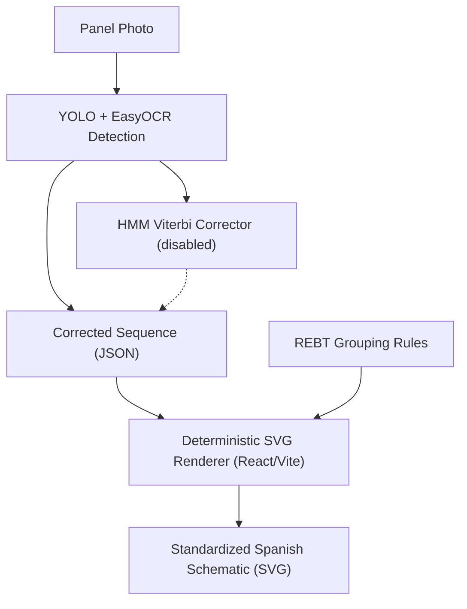

# Electrical Schematic Generator & Serving Infrastructure

The main value proposition of the PanelSafe final project is helping electricians instantly produce compliance paperwork (such as Boletines and single-line schematics) from a single panel photo.

> **Document scope:** This page describes the system **as currently built**. Components that are designed but not yet implemented are collected in the [Roadmap](#roadmap--not-yet-implemented) section at the end and must not be presented as live.

## Sequence-to-Schematic Pipeline

> **HMM correction is currently disabled** (`use_hmm: false`) — it measurably reduced
> classification accuracy on the full real val set. See [hmm_decoder](/models/hmm_decoder.md)
> for the ablation evidence and root-cause investigation. YOLO detections pass straight
> through to the corrected-sequence JSON.

## Current Implementation

### Gateway (`app/main.py`)
- A **FastAPI** application serves the consumer PWA (static frontend) and the compiled `panel-safe-unifilar` React app (mounted at `/unifilar`).
- It acts as a **lightweight router**: `/predict/` and `/upload/` forward the image to the GPU inference worker over the `INFERENCE_URL` endpoint (the `gpu-worker:8088` Tailscale alias). The gateway itself runs no models.
- `/upload/` additionally performs automated safety grading ([rebt_rules](/standards/rebt_rules.md)-based) and persists upload metadata to `upload_log.json`.

### Inference Worker (`src/model/inference_server.py`)
- A standalone **Python `http.server` (`ThreadingHTTPServer`)** exposing `POST /predict`. It is **not** FastAPI and currently has no rate-limiting or caching layer.
- It runs the full `PanelSafePipeline`: YOLO26 detection → optional EfficientNet crop classifier (`classifier_mode`, currently `single_stage`) → EasyOCR text reads → HMM Viterbi correction (`use_hmm`, currently **`false`** — see [hmm_decoder](/models/hmm_decoder.md) for why).

### Deployment (`yolo-inference-deployment.yaml`)
- The worker is deployed on a local **K3s** cluster using the `ultralytics/ultralytics` image, pinned to the GPU node with `nvidia.com/gpu` passthrough.
- The pod uses `hostNetwork: true` and binds host port `8088` (also exposed as NodePort `30088`). Because of `hostNetwork`, the `gpu-worker:8088` Tailscale alias and the K3s pod are the **same endpoint** — the gateway reaches the pod directly via the host.

### Schematic Rendering (`panel-safe-unifilar/`)
- The single-line schematic is produced by a **deterministic client-side React/Vite app** (`parser/` + `components/`), not an LLM. It parses the corrected JSON sequence and renders SVG using Spanish DIN-rail symbols and REBT grouping rules.

### Upload De-duplication
- Incoming uploads are hashed with **SHA-256** and checked against a `seen_hashes` set to avoid storing duplicate photos. Note: this is **upload de-duplication**, not inference-result caching.

## Roadmap / Not Yet Implemented

> None of the items below exist in the codebase yet (no `redis`, `slowapi`, `deepchecks`, `zenml`, `ollama`, or `llama` dependency is present). They are the planned hardening path for the serving stack.

- **Redis-backed exact inference caching:** Key detection results by image SHA-256 in Redis so repeat photos bypass model inference.
- **`slowapi` rate-limiting (Redis-backed):** Protect the expensive inference endpoints from abuse / overload.
- **Deepchecks drift detection:** Check incoming user images for data and property drift (brightness, contrast, camera perspective) against the training distribution.
- **ZenML retraining orchestration:** Run the Deepchecks evaluations on a schedule and trigger automated retraining pipelines when drift thresholds are breached.
- **Slack alerting:** Notify the engineering team when a drift threshold is violated or a retraining run completes.
- **LLM-assisted schematic mapping (optional):** A locally run Llama-3 (via Ollama) as an alternative path to the deterministic renderer for free-form layout reasoning.
- **Tiny test-button detector (Strategy G):** A micro-model verifying the physical "Test" button inside RCD crops (`use_button_detector` flag exists in `pipeline_config.json`, model not yet built).
